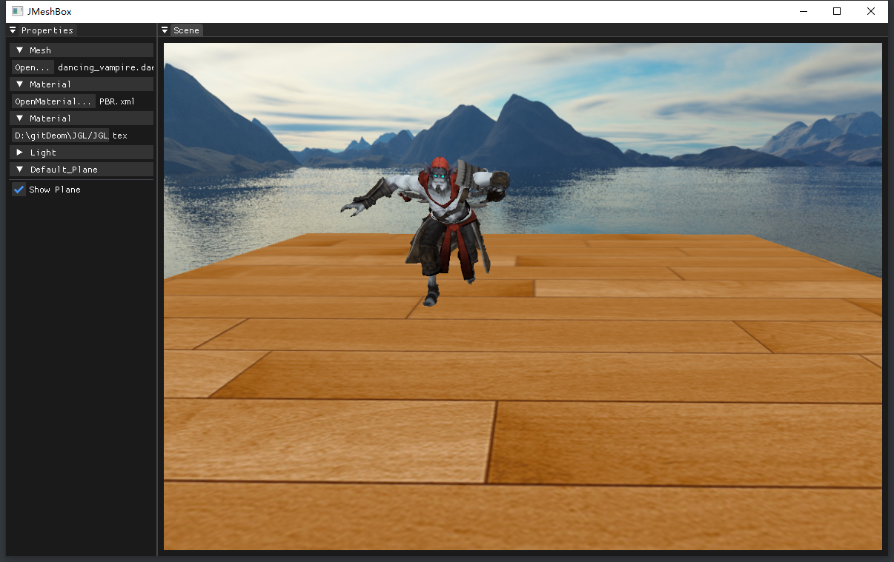

# JGL Demos

这是一个基于 OpenGL 的渲染实验项目，当前已经包含：
- 编辑器式窗口与 `SceneView / Property Panel`
- 模型、材质、Shader 与纹理加载
- Forward / Deferred 两套渲染路径
- PBR、天空盒、Bloom、毛发与骨骼动画示例
- 可逐步演进成独立渲染引擎的运行时结构

## 文档索引

`sections/` 目录收集了当前项目的设计文档和功能说明，建议按下面顺序阅读：

- [编辑器架构](sections/JGLEditor.md)
  说明窗口循环、SceneView、Property Panel 与资源加载入口。
- [延迟渲染管线设计](sections/延迟渲染管线设计.md)
  说明 G-Buffer、Lighting Pass、Forward Overlay 与 UI 切换方案。
- [Python 接口设计](sections/Python接口设计.md)
  说明如何把当前运行时封装为可被 Python 调用的场景与对象接口。
- [骨骼动画加载](sections/骨骼动画加载.md)
  说明 Assimp 骨骼提取、Animation/Animator 更新与 GPU 蒙皮流程。
- [PBR 材质](sections/PBR材质.md)
  说明 PBR 贴图通道、材质参数和光照计算约定。
- [Bloom](sections/bloom.md)
  说明 Bloom 示例当前状态、接入点与扩展方向。
- [毛发材质](sections/Fur.md)
  说明多 Pass 毛发表现与参数控制方式。
- [星空材质](sections/SkyNight.md)
  说明体积感夜空效果的 shader 思路与使用方式。
- [天气效果](sections/Weather.md)
  说明天气与水面扰动相关实验内容。

## 当前代码结构

- `JGL_MeshLoader/source/engine`
  渲染运行时、资源管理与对外可复用接口。
- `JGL_MeshLoader/source/ui`
  ImGui 界面层，包括 Scene 面板与属性面板。
- `JGL_MeshLoader/source/render`
  OpenGL 上下文、FBO/G-Buffer 与底层缓冲管理。
- `JGL_MeshLoader/source/elems`
  相机、模型、材质、动画等场景元素。
- `JGL_MeshLoader/shaders`
  Forward、Deferred、后处理与内置效果 shader。
- `JGL_MeshLoader/resource`
  默认模型、材质定义、纹理与内置资源。

## 技术栈

- GLEW: <http://glew.sourceforge.net/>
- GLFW: <https://www.glfw.org/>
- GLM: <https://glm.g-truc.net/0.9.9/index.html>
- Assimp: <https://github.com/assimp/assimp>
- ImGui: <https://github.com/ocornut/imgui>
