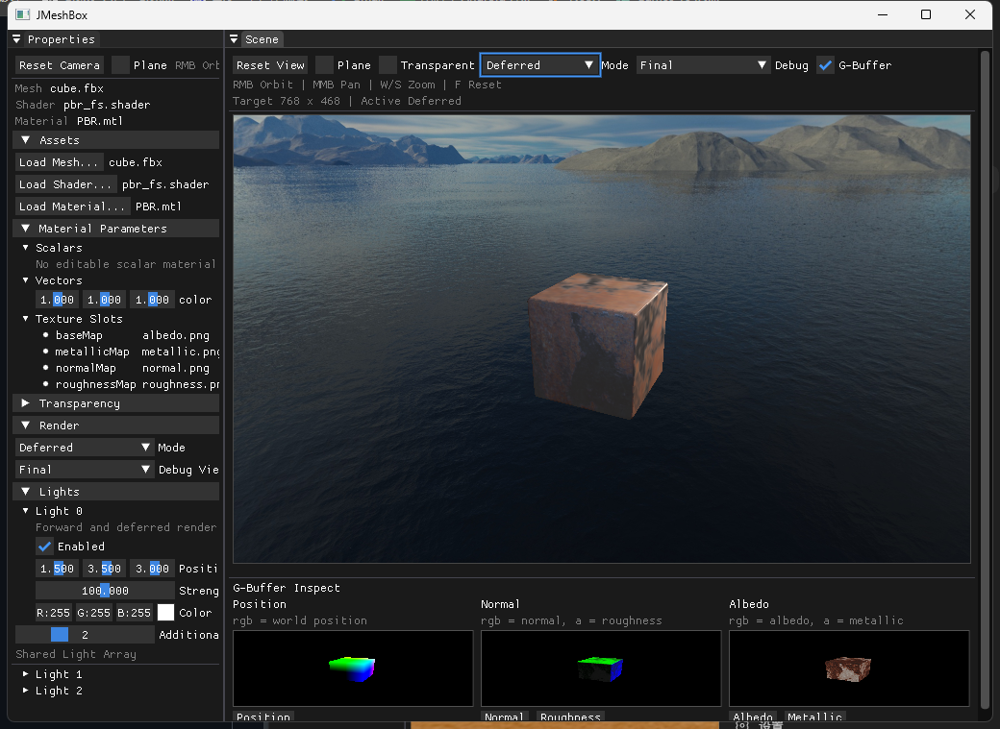

# JGL Engine

JGL Engine 是一个基于 OpenGL 的实时渲染引擎原型。
它正从早期的渲染实验项目，逐步演进为具备运行时内核、资源系统、编辑器外壳与双渲染管线能力的轻量引擎。

> 当前封面展示的是 JGL Engine 的编辑器界面、延迟渲染主视口以及 G-Buffer 调试预览。

## 项目概述

当前 JGL Engine 主要聚焦在渲染引擎核心层的建设：

- 可复用的渲染运行时
- 基于 OpenGL 的 Forward / Deferred 双渲染路径
- 材质、Shader、模型与纹理资源加载
- 面向 PBR 的材质与光照工作流
- 骨骼动画导入、更新与 GPU 蒙皮
- 基于 ImGui 的场景调试与编辑器界面

这套代码已经不再只是若干效果示例的集合，而是在逐步形成一个可以继续抽象、嵌入和对外调用的小型渲染引擎内核。

## 当前能力

- 前向渲染
  - 支持不透明物体、透明物体和基础实时显示路径
- 延迟渲染
  - 支持 G-Buffer、Lighting Pass、Forward Overlay Pass 和调试视图
- 材质系统
  - 支持 `.mtl` 材质定义、Shader 绑定、贴图槽、标量与向量参数
- 资源加载
  - 通过资源管理器统一加载 mesh、shader、material、cubemap 和 texture
- 场景运行时
  - 包含相机控制、天空盒、地面、灯光数组、离屏渲染与场景视口输出
- 动画系统
  - 支持基于 Assimp 的骨骼提取、动画更新与 GPU 蒙皮
- 编辑器外壳
  - 包含 SceneView、Property Panel、调试预览、文件加载与渲染模式切换

## 架构分层

- `JGL_MeshLoader/source/engine`
  - 渲染运行时、资源管理器以及对外可复用接口
- `JGL_MeshLoader/source/render`
  - OpenGL 上下文、Framebuffer、Deferred G-Buffer 与底层缓冲管理
- `JGL_MeshLoader/source/elems`
  - 相机、模型、材质、动画、网格与场景元素数据
- `JGL_MeshLoader/source/ui`
  - ImGui 编辑器外壳、场景视口与属性面板
- `JGL_MeshLoader/shaders`
  - Forward、Deferred、内置效果与后处理 Shader
- `JGL_MeshLoader/resource`
  - 默认资源、材质定义、纹理与内置资产

## 文档索引

`sections/` 目录中保存了当前功能设计和实现说明：

- [编辑器架构](sections/JGLEditor.md)
- [延迟渲染管线设计](sections/延迟渲染管线设计.md)
- [Python 接口设计](sections/Python接口设计.md)
- [骨骼动画加载](sections/骨骼动画加载.md)
- [PBR 材质](sections/PBR材质.md)
- [Bloom](sections/bloom.md)
- [毛发材质](sections/Fur.md)
- [星空材质](sections/SkyNight.md)
- [天气效果](sections/Weather.md)

## 项目定位

当前 JGL Engine 更适合被理解为：

- 一个持续演进中的渲染引擎核心
- 一个用于渲染调试、效果验证和运行时开发的桌面编辑器外壳
- 一个未来可被 Python 或其他宿主程序调用的渲染基础设施

它还不是一个完整的生产级引擎，但已经具备继续工程化演进的基础。

## TODO List

在成为更完整的引擎平台之前，JGL Engine 仍缺少以下能力：

- 场景图或基于 ECS 的场景数据模型
- 面向外部宿主程序的稳定运行时 API
- 可正式使用的 Python 绑定层与脚本场景创建接口
- 方向光、点光、聚光的阴影系统
- IBL 与反射环境光照流程
- 可配置的后处理框架与 Render Graph / Pass Graph
- 比当前 forward overlay 更完整的透明物体方案
- 灯光、相机、可渲染对象的统一序列化格式
- 带缓存、预处理和依赖跟踪的资源导入流水线
- Shader、材质、纹理的热重载能力
- 编辑器层与运行时层更彻底的模块解耦
- 自动化测试、验证场景和 CI 构建流程
- 多场景管理与保存/加载工作流
- 更清晰的跨平台窗口与平台抽象
- 除 OpenGL 之外的渲染后端抽象

## 技术栈

- OpenGL
- GLEW
- GLFW
- GLM
- Assimp
- ImGui
