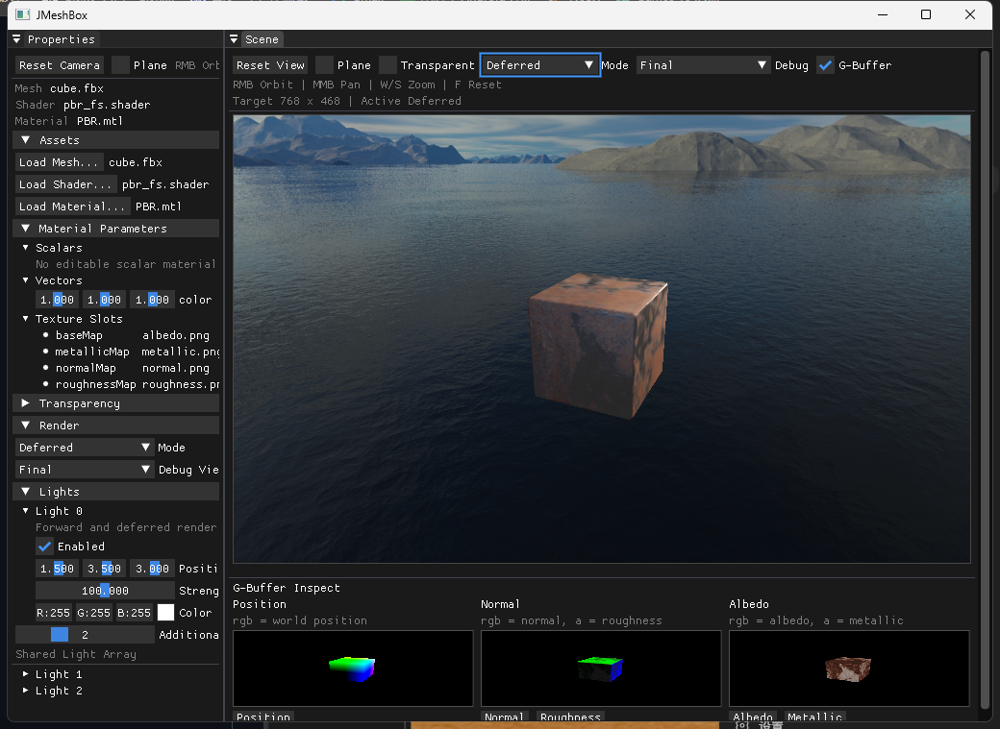

# JGL_Engine



JGL_Engine 是一个基于 OpenGL 的实时渲染引擎原型。
它正在从早期的渲染实验项目，逐步演进为具备运行时内核、资源系统、编辑器外壳，以及 Forward / Deferred 双渲染管线能力的轻量引擎。

> 当前封面展示的是 JGL_Engine 的编辑器界面、延迟渲染主视口，以及 G-Buffer 调试预览。

## 项目概述

当前 JGL_Engine 主要聚焦在渲染引擎核心层的建设：

- 可复用的渲染运行时
- 基于 OpenGL 的 Forward / Deferred 双渲染路径
- 材质、Shader、模型与纹理资源加载
- 面向 PBR 的材质与光照工作流
- 骨骼动画导入、更新与 GPU 蒙皮
- 基于 ImGui 的场景调试与编辑器界面

这套代码已经不再只是若干效果示例的集合，而是在逐步形成一个可以继续抽象、嵌入和对外调用的小型渲染引擎内核。

## 当前能力

- 渲染路径与调试
  - 支持 Forward / Deferred 双渲染路径，Deferred 已接入 G-Buffer、Lighting Pass、Forward Overlay Pass
  - 支持 `Final / Position / Normal / Albedo / Roughness / Metallic` 调试视图
  - 已接入基础渲染队列、透明排序和视锥剔除
- 光照、环境与后处理
  - 支持 PBR 材质工作流、HDR 环境图加载、内置 skybox 回退与 IBL 预计算
  - 支持方向光阴影映射，可在编辑器中调节 `Cast Shadows`、Bias 和 PCF 半径
  - 支持屏幕后处理材质切换与参数编辑，可挂接雨雪等 screen effect
- 资源与场景
  - 通过资源管理器统一加载 mesh、shader、material、texture、cubemap 和动画资产
  - 支持 XML 场景资源加载与导出，当前已覆盖 `Mesh / Terrain / Light / EnvironmentMap`
  - 默认展示场景由 `Assets/scenes/default_scene.xml` 驱动，加载失败时会回退到内置场景
- 几何、动画与地形
  - 支持基于 Assimp 的模型导入、骨骼提取、动画更新与 GPU 蒙皮
  - 已接入程序化地形系统，并可复用现有材质、渲染、脚本和编辑器链路
- 编辑器与工具
  - 当前编辑器面板包括 `Scene Hierarchy`、`Inspector`、`Render Settings`、`Scene`
  - 支持创建/删除 Mesh、Terrain、Light，加载模型、材质、Shader、动画与场景资源
  - 支持 Shader 热重载、RenderDoc 抓帧、HDR 环境切换、IBL 预览和运行时参数调试
- 脚本入口
  - 已接入 Python 绑定入口，默认脚本入口为 `Game/script/showcase_scene.py`
  - Python API 已可用于运行引擎与访问场景对象，但整体宿主接口仍在持续演进

## 架构分层

- `JGL_Engine/source/engine`
  - 渲染运行时、资源管理器以及对外可复用接口
- `JGL_Engine/source/render`
  - OpenGL 上下文、Framebuffer、Deferred G-Buffer 与底层缓冲管理
- `JGL_Engine/source/elems`
  - 相机、模型、材质、动画、网格与场景元素数据
- `JGL_Engine/source/ui`
  - ImGui 编辑器外壳、场景视口与属性面板
- `JGL_Engine/shaders`
  - Forward、Deferred、内置效果与后处理 Shader
- `Assets`
  - 默认资源、材质定义、纹理与内置资产

## 文档与图片

文档已统一收拢到 `docs/`（包含原 `sections/` 与 `JGL_Engine/docs/` 的内容）：

- 推荐先读
  - [文档索引](docs/index.md)
  - [JGL Wiki](docs/wiki/index.md)
  - [功能说明](docs/engine/feature_guide.md)
  - [渲染管线（当前实现）](docs/engine/rendering_pipeline.md)
  - [渲染管线（教学向）](docs/engine/rendering_pipeline_tutorial.md)
- 当前实现与架构
  - [渲染队列（当前实现）](docs/engine/render_queue.md)
  - [地形系统实现原理](docs/engine/terrain_system.md)
  - [架构重构总结](docs/engine/architecture_summary.md)
  - [深入解析 JGL Engine 中的基于物理渲染 (PBR) 系统](docs/PBR_Implementation.md)
- 编辑器与功能专题
  - [编辑器面板与工作流](docs/sections/JGLEditor.md)
  - [延迟渲染管线设计](docs/sections/延迟渲染管线设计.md)
  - [Python 接口（当前状态）](docs/sections/Python接口设计.md)
  - [骨骼动画加载](docs/sections/骨骼动画加载.md)
  - [PBR 材质](docs/sections/PBR材质.md)
  - [Bloom](docs/sections/bloom.md)
  - [毛发材质](docs/sections/Fur.md)
  - [星空材质](docs/sections/SkyNight.md)
  - [天气效果](docs/sections/Weather.md)
- API 与文档生成
  - [API Docs 入口](docs/api/index.md)
  - [C++ Runtime API](docs/api/cpp_runtime_api.md)
  - [Python API](docs/api/python_api.md)
  - [API Docs 说明](docs/README.md)

文档图片资源已随仓库提交，主要位于以下目录：

- `Images/README`
- `sections/Images`

## 构建方法

### 环境要求

- Windows
- CMake 3.16 及以上
- Visual Studio 2019/2022 或兼容的 MSVC 工具链

项目依赖的 `GLEW / GLFW / Assimp / ImGui / GLM` 已按当前工程结构接入仓库，其中运行时 `assimp` 动态库会在构建后自动复制到输出目录。

### 使用 CMake 构建

在仓库根目录执行：

```powershell
cmake -S . -B build
cmake --build build --config Debug
```

生成完成后，运行：

```powershell
.\build\bin\Debug\JGL_Engine.exe
```

如果需要 `Release` 版本，可改为：

```powershell
cmake --build build --config Release
.\build\bin\Release\JGL_Engine.exe
```

## 项目定位

当前 JGL_Engine 更适合被理解为：

- 一个持续演进中的渲染引擎核心
- 一个用于渲染调试、效果验证和运行时开发的桌面编辑器外壳
- 一个未来可被 Python 或其他宿主程序调用的渲染基础设施

它还不是一个完整的生产级引擎，但已经具备继续工程化演进的基础。

## TODO List

在成为更完整的引擎平台之前，JGL_Engine 仍缺少以下能力：

- 更稳定的场景图 / ECS 数据模型，以及更统一的场景序列化格式
- 面向外部宿主程序的稳定运行时 API 与更完整的 Python 工作流
- 点光 / 聚光阴影、级联阴影或更高阶的阴影方案
- 更完整的 IBL、反射探针与局部环境光照流程
- 可配置的后处理框架与 Render Graph / Pass Graph
- 比当前 forward overlay 更完整的透明物体方案
- 带缓存、预处理和依赖跟踪的资源导入流水线
- 材质、纹理和更广范围资产的热重载能力
- 编辑器层与运行时层更彻底的模块解耦
- 自动化测试、验证场景和 CI 构建流程
- 多场景管理、Undo/Redo 与更完整的保存/加载工作流
- 更清晰的跨平台窗口与平台抽象
- 除 OpenGL 之外的渲染后端抽象

## 技术栈

- OpenGL
- GLEW
- GLFW
- GLM
- Assimp
- ImGui
