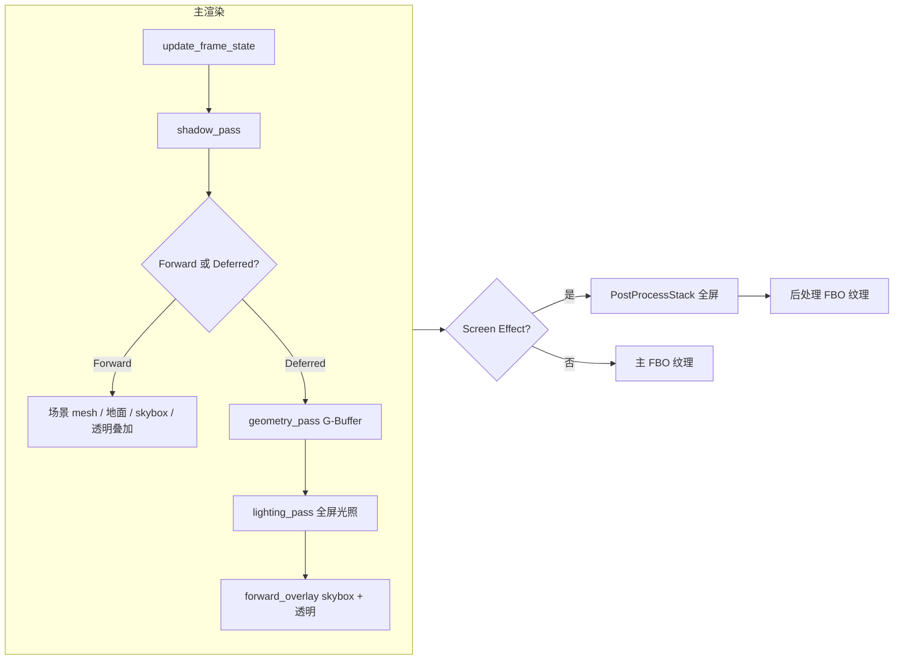

# JGL 渲染管线：原理与实现（教学向）

本文面向希望**理解“为什么这样画一帧”**的读者，结合仓库里 `nengine::RenderEngine` 的真实实现，把 Forward / Deferred、阴影、IBL、后处理串成一条可对照代码的阅读路线。若只需条目式说明，可参见同目录下的 [rendering_pipeline.md](rendering_pipeline.md)。

---

## 1. 渲染管线在解决什么问题？

实时渲染的一帧可以抽象成：**把三维场景里的几何，按相机视角变成一张二维图像**。GPU 通过**光栅化**（三角形 → 像素）和**片元着色器**（每个像素算颜色）完成这件事。

工程上通常不会“一口气算完所有效果”，而是拆成多个**Pass**（渲染通道）：每个 Pass 绑定不同的帧缓冲、着色器和状态，输出中间结果（深度图、G-Buffer、HDR 颜色等），再被后续 Pass 消费。JGL 的主入口是 `RenderEngine::render()`：先完成“主场景颜色”到离屏 framebuffer，再可选地做全屏后处理。

---

## 2. 一帧的总流程（与代码对应）

核心分支在 `render_engine.cpp` 的 `render()`：

- **Deferred 模式**：`render_deferred_to_framebuffer()`
- **Forward 模式**：`render_forward_to_framebuffer()`
- **两者之后**：若配置了 Screen Effect，则 `PostProcessStack::render()` 以主 framebuffer 的颜色纹理为输入，再画到后处理自己的 framebuffer。

**输出给谁看**：UI/编辑器通过 `get_output_texture()` 取纹理；若有后处理且已生效，优先返回后处理输出，否则返回主 framebuffer 纹理。

---

## 3. Forward 与 Deferred：两种“算光照”的策略

### 3.1 概念对比（教学）

| 方面 | Forward | Deferred |
|------|---------|----------|
| 光照计算时机 | 画每个物体时，片元着色器里算光照 | 先只存几何/材质属性，再全屏对每个像素算光照 |
| 光源很多时 | 容易重复计算（多光源 × 多物体） | 光源数量主要影响全屏 pass，与物体 draw call 解耦更明显 |
| 透明物体 | 自然支持排序混合 | 通常需额外 forward 叠加 |

### 3.2 本引擎中的 Forward

`render_forward_to_framebuffer()` 顺序大致为：更新状态 → **阴影 pass** → 绑定主 framebuffer → 不透明 mesh → 可选地面 → skybox → **透明叠加**（混合 + 关闭深度写入）。

每个 mesh 使用自己的材质着色器；`render_mesh_object()` 里会 `upload_lights()`、绑定 **IBL** 贴图、应用骨骼等。也就是说：**光照方程写在各 forward 片元着色器里**（与具体材质绑定）。

### 3.3 本引擎中的 Deferred

1. **Geometry Pass**（`geometry_pass()`）  
   - 绑定 `DeferredGBuffer` 的 FBO。  
   - 用统一的 `deferred_gbuffer` 着色器把每个像素需要的信息写到多张**渲染目标（MRT）**。

2. **G-Buffer 里存了什么？**（见 `deferred_gbuffer.cpp`）  
   - **COLOR0**：世界空间位置相关（RGBA16F）  
   - **COLOR1**：法线 + 粗糙度等（RGBA16F）  
   - **COLOR2**：反照率 + 金属度（RGBA8）  
   - **深度模板**：深度 + stencil，供后续拷贝到主 framebuffer，使 skybox/透明物体与几何深度一致  

   教学要点：**延迟渲染不是“不画几何”，而是几何阶段不写最终颜色，只写属性纹理**。

3. **Lighting Pass**（`lighting_pass()`）  
   - 绑定**主**离屏 framebuffer，**关闭深度测试**，画一个**全屏四边形**。  
   - 片元着色器对每个屏幕像素：用 UV 采样三张 G-Buffer 纹理，重建该像素的世界位置、法线、材质参数，再算 PBR + 光源 + IBL。  
   - 最后 `copy_depth_to` 把 G-Buffer 的深度拷到主 FBO，为后续 overlay 正确遮挡做准备。

4. **Forward Overlay**（`forward_overlay_pass()`）  
   - Skybox 与**透明物体**仍走 forward 路径，叠在延迟结果之上（混合、深度已对齐）。

### 3.4 何时自动退回 Forward？

`is_deferred_available()` 要求：**场景中每个带 mesh 的实体**都满足 `is_mesh_deferred_available()`——即材质纹理映射里同时具备 `baseMap`、`metallicMap`、`roughnessMap`、`normalMap`、`aoMap`。  
任一缺失则 `render_deferred_to_framebuffer()` 内部直接调用 `render_forward_to_framebuffer()`。  
这是工程上的务实选择：**延迟几何 pass 只有一套 shader，需要完整的 PBR 贴图集**。

---

## 4. 阴影：Shadow Map 在实现里如何落地？

### 4.1 原理简述

方向光没有“位置上的发光点”，常用**正交投影**从光源方向看场景，把**深度**渲染到一张纹理（shadow map）。光照阶段把像素变换到**光源空间**，与 shadow map 比较深度，判断是否在阴影中。

### 4.2 本实现要点（`shadow_pass()`）

- 选用场景中**第一个**满足条件的方向光：`enabled`、类型为 Directional、`casts_shadows`。  
- 用场景 AABB（失败则用默认盒子）估计范围，算 **light view + ortho 投影**，得到 `lightSpaceMatrix`。  
- 在独立 FBO（如 2048×2048）里只清深度；**正面剔除**（`glCullFace(GL_FRONT)`）减轻阴影痤疮（shadow acne）。  
- 深度着色器只写深度；mesh 与可选地面都会绘制。  
- Forward 与 Deferred 的**光照**都会 `upload_lights()` → `apply_shadow_state()`：绑定同一张 shadow map，并传入 `shadowLightIndex`、bias、PCF 半径等 uniform。

教学提示：**阴影 pass 与“最终颜色”无关，只更新一张深度纹理**，供后续光照采样。

---

## 5. IBL：环境光为什么要三张“衍生贴图”？

PBR 里镜面项需要对环境贴图按**粗糙度**做不同模糊程度的采样；漫反射则需要**半球积分**后的低频环境光。若每帧对 HDR cubemap 实时积分，代价过高。

`IBLPipeline` 在**加载环境或 cubemap 变化时**离线（相对帧而言）生成：

1. **Environment Cubemap**：场景周围“往哪看是什么颜色”。可由 `.hdr` 经 equirectangular → cubemap。  
2. **Irradiance Map**：对环境做漫反射卷积，近似 **\(E_{\mathrm{diffuse}}\)**。  
3. **Prefilter Map**：带 mipmap 的预过滤环境，按粗糙度选 LOD，近似 **\(E_{\mathrm{spec}}\)**。  
4. **BRDF LUT**：二维查找表，把 Fresnel、几何遮挡等积分结果预计算进一张 2D 纹理。

`apply_ibl_to_shader()` 负责：若 IBL 就绪则设置 `iblEnabled`、`irradianceMap`、`prefilterMap`、`brdfLUT` 及 `prefilterMaxLod`，并把立方体/2D 纹理绑到约定纹理单元（Forward 与 Deferred 使用不同 unit 常量，避免与别的贴图冲突）。

---

## 6. 后处理：`PostProcessStack` 在做什么？

后处理在图形学里几乎是固定套路：**全屏三角形/四边形 + 一张“场景颜色”纹理**。

`PostProcessStack::render()`：

1. 绑定**单独的输出 framebuffer**（与主分辨率一致，尺寸变化会重建）。  
2. 使用公共顶点着色器 `post_process_vs.shader` + 材质指定的片元着色器。  
3. 绑定 `hdrBuffer` 为纹理单元 0，并传入 `time`、`screenResolution`；其余参数由 `Material::update_shader_params` 驱动。  
4. 关闭深度测试绘制四边形，避免全屏 quad 被深度挡住。

**为何多一个 FBO**：效果 shader 通常要读“上一帧已算好的颜色”；若直接写回同一纹理，在未做 ping-pong 的情况下容易读到未定义或自身写入的结果。这里实现为**写到后处理专用 FBO**，展示时通过 `get_output_texture()` 选择最终纹理。

---

## 7. 调试与扩展时该看哪里？

| 主题 | 建议阅读 |
|------|----------|
| 每帧顺序、模式切换 | `render_engine.cpp`：`render()`、`render_forward_to_framebuffer()`、`render_deferred_to_framebuffer()` |
| G-Buffer 格式与 MRT | `deferred_gbuffer.cpp`、`deferred_gbuffer_fs.shader`（几何）、`deferred_lighting_fs.shader`（光照） |
| 阴影矩阵与绘制 | `shadow_pass()`、`upload_lights()`、`apply_shadow_state()` |
| IBL 生成流程 | `ibl_pipeline.cpp`（cubemap / irradiance / prefilter / BRDF） |
| 全屏后处理 | `post_process_stack.cpp`、`post_process_vs.shader`、自定义 effect 的 fs |
| Deferred 调试图 | `DebugView` + lighting shader 中 `debugView` uniform |

---

## 8. 小结

- **主渲染**在离屏 framebuffer 中完成，支持 **Forward / Deferred**；Deferred 用 **G-Buffer + 全屏光照**，透明与天空盒用 **Forward 叠加**。  
- **阴影**是独立深度 pass + 光照阶段采样。  
- **IBL** 把环境光照拆成预计算纹理，在 forward 与 deferred 中统一注入。  
- **后处理**是全屏 Pass，读取主颜色纹理并输出到专用纹理，供最终呈现。

按上述顺序阅读源码，可以把教科书里的“延迟渲染 / Shadow Mapping / IBL / Post-process”与仓库里的类名、函数名一一对上，便于自己做实验（改 G-Buffer 布局、换光照模型、加新后处理）时定位修改点。
