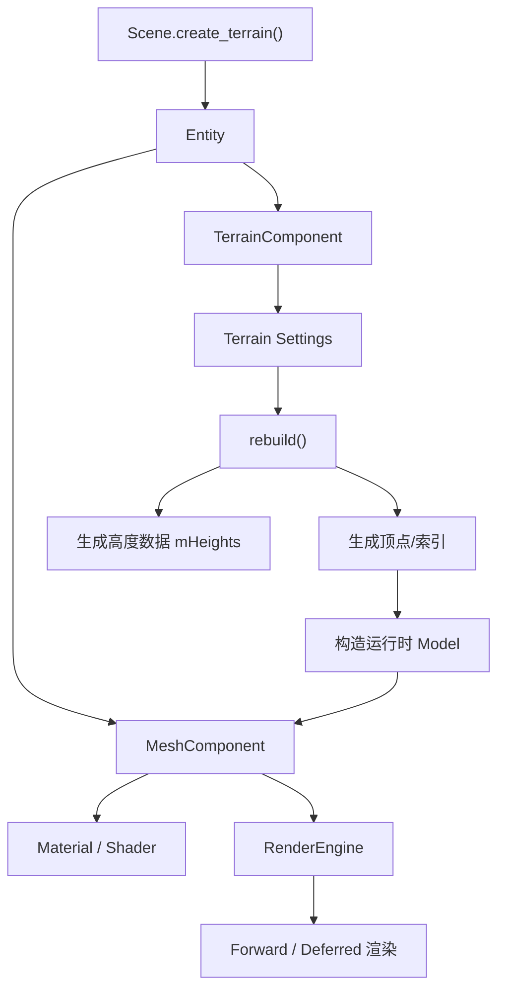

# 地形系统实现原理

本文基于当前仓库里已经落地的程序化地形实现来讲，不讨论“理想中的通用地形引擎”，而是专注于这套代码现在是怎么工作的、为什么这样设计、后面还能往哪里扩展。

## 1. 设计目标

这次地形系统的目标不是一次性做完大世界、LOD、地表绘制、物理碰撞，而是先把下面几件事做扎实：

- 能在运行时生成一块可渲染的地形网格
- 能复用现有 `Mesh + Material + Shader + Scene` 渲染链路
- 能通过 XML 场景资源、Python 脚本和编辑器面板统一控制
- 能保留后续继续扩展为 heightmap、分块地形、植被系统的空间

所以这套实现更像“程序化高度场地形的第一层基础设施”。

## 2. 整体架构

当前地形系统不是单独做一套渲染器，而是挂在现有场景对象模型上。



核心思想是：

- `TerrainComponent` 负责“生成什么样的地形”
- `MeshComponent` 负责“把生成结果当成普通网格去渲染”

这样做的好处是，地形不会绕开现有系统。它天然支持：

- 现有材质系统
- 现有 shader 热重载
- 现有前向 / 延迟渲染
- 现有场景管理
- 现有编辑器 Inspector

## 3. 关键类职责

### 3.1 `TerrainComponent`

代码入口：`JGL_Engine/source/engine/scene.h`

`TerrainComponent` 是地形系统的核心数据组件，内部保存一组 `Settings`：

- `width` / `depth`：地形在 XZ 平面上的尺寸
- `resolution_x` / `resolution_z`：网格细分数
- `height_scale`：高度振幅
- `height_offset`：整体高度偏移
- `uv_scale`：纹理坐标缩放
- `noise_frequency`：基础噪声频率
- `noise_octaves`：噪声叠加层数
- `noise_persistence`：每层振幅衰减
- `noise_lacunarity`：每层频率放大倍率
- `seed`：随机种子

它还维护一份 `mHeights` 高度缓存，用于：

- 重建顶点
- 计算法线
- 对外提供 `sample_height()`

### 3.2 `MeshComponent`

代码入口：`JGL_Engine/source/engine/scene.h`

原本 `MeshComponent` 只负责加载磁盘上的模型文件。为了让程序化地形能接进来，这次补了：

```cpp
bool set_runtime_model(std::shared_ptr<nelems::Model> model, const std::string& debug_label = "Generated");
```

这一步很关键，因为它把“运行时生成网格”正式变成了引擎的一等公民，而不是临时 hack。

### 3.3 `Model`

代码入口：`JGL_Engine/source/elems/model.h`

`Model` 新增了一个运行时构造入口，可以直接从内存里的 `Mesh` 列表和包围盒创建：

- 不需要经过 Assimp
- 不依赖磁盘模型文件
- 仍然可以被 `RenderEngine` 当成普通模型绘制

## 4. 为什么是“Terrain + Mesh”双组件

如果把地形做成一个完全独立的 `TerrainRenderer`，短期也能跑，但会带来几个问题：

- 地形材质会绕开现有 `Material`
- 渲染逻辑会和普通模型分叉
- Scene / XML / Python / Editor 都要写一套特殊入口
- 后面想让地形也走延迟渲染、阴影、后处理时会越来越难维护

现在的做法是：

1. `Scene::create_terrain()` 先创建一个普通 `Mesh` 实体
2. 再给这个实体额外挂一个 `TerrainComponent`
3. `TerrainComponent::rebuild()` 生成网格
4. 生成结果塞回 `MeshComponent`
5. `RenderEngine` 完全不需要知道“这块网格是文件加载的，还是程序生成的”

这就是这次实现里最重要的结构性选择。

## 5. 地形生成流程

### 5.1 创建入口

代码入口：`JGL_Engine/source/engine/scene.cpp`

```cpp
std::shared_ptr<Entity> Scene::create_terrain(const std::string& name)
{
  auto entity = create_mesh(name);
  auto* mesh = entity->get_component<MeshComponent>();
  entity->add_component<TerrainComponent>(mesh, mResources.lock());
  return entity;
}
```

这里说明两件事：

- 地形本质上仍然是一个可渲染网格实体
- `TerrainComponent` 构造时就拿到了对应的 `MeshComponent`

所以后面它可以直接把生成好的结果写回去。

### 5.2 参数规范化

代码入口：`TerrainComponent::apply_settings()`

在真正生成之前，系统会先把参数做一轮限制：

- 分辨率限制在 `[2, 512]`
- octave 限制在 `[1, 8]`
- 频率、宽高、UV 缩放保证为正
- `height_scale` 不允许小于 0

这样做是为了防止编辑器或脚本把参数改到不可用状态，导致生成非法网格。

### 5.3 高度计算

代码入口：`TerrainComponent::evaluate_height()`

当前实现不是 Perlin Noise，也不是 Simplex Noise，而是更容易读懂的：

- 网格哈希随机值
- 双线性插值
- 多层叠加的 fBm 风格噪声

其流程可以概括成：

1. 用 `hash_grid(x, z, seed)` 生成稳定伪随机值
2. `random_grid_value()` 把哈希映射到 `[-1, 1]`
3. `value_noise()` 在四个格点之间做平滑插值
4. `evaluate_height()` 用多层 octave 叠加形成细节

高度公式可以近似理解为：

```text
noise_sum = Σ(value_noise(local_x * frequency_i, local_z * frequency_i) * amplitude_i)
normalized_noise = noise_sum / Σ(amplitude_i)
height = height_offset + normalized_noise * height_scale
```

其中：

- `frequency` 控制山丘起伏尺度
- `persistence` 控制高频细节保留多少
- `lacunarity` 控制每层频率放大倍率
- `seed` 决定整体地形随机形态

### 5.4 网格顶点布局

代码入口：`TerrainComponent::rebuild()`

地形本质上是一张规则网格。

若：

- `resolution_x = 96`
- `resolution_z = 96`

那么会生成：

- 顶点数：`(96 + 1) * (96 + 1)`
- 三角形数：`96 * 96 * 2`

顶点在局部空间里铺在 XZ 平面上：

- X 范围：`[-width/2, width/2]`
- Z 范围：`[-depth/2, depth/2]`
- Y 由噪声高度决定

这意味着地形的“平面范围”和“高度范围”是分离控制的。

### 5.5 UV、法线、切线

为了让 PBR 材质直接可用，生成时不仅要有位置，还要补全：

- `mTextureCoords`
- `mNormal`
- `mTangent`
- `mBitangent`

当前法线不是简单写死 `(0,1,0)`，而是通过相邻高度差估算斜率：

```text
left / right / down / up
-> 构造 tangent 和 bitangent
-> 叉乘得到 normal
```

这样地形起伏会真实影响光照，而不是一整片平面打光。

### 5.6 索引生成

每个网格小方块会拆成两个三角形：

```text
i0 ---- i1
 |    / |
 |  /   |
i2 ---- i3
```

索引顺序是：

- `i0, i2, i1`
- `i1, i2, i3`

这保证整个地形能以连续三角面方式提交给 GPU。

### 5.7 运行时模型注入

当顶点和索引构造完成后，系统会：

1. 生成一个 `nelems::Mesh`
2. 放进 `std::vector<nelems::Mesh>`
3. 构造运行时 `Model`
4. 调用 `MeshComponent::set_runtime_model()`

这一步是地形从“算法结果”变成“引擎可渲染对象”的桥梁。

## 6. 渲染链路为什么可以直接复用

一旦运行时 `Model` 被塞进 `MeshComponent`，后面的渲染流程就和普通模型完全一致了。

`RenderEngine` 在遍历场景时只看：

- 这个实体有没有 `MeshComponent`
- `MeshComponent` 里有没有 `model / material / shader`

它不关心数据来源。

所以地形自动获得了：

- Forward 渲染支持
- Deferred 渲染支持
- 阴影支持
- IBL / PBR 支持
- 后处理兼容

这也是复用现有网格管线最大的收益。

## 7. 场景资源接入

代码入口：`JGL_Engine/source/engine/scene_loader.cpp`

场景 XML 现在支持 `<Terrain>` 节点。典型配置如下：

```xml
<Terrain
  Name="terrain"
  Material="Assets/materials/PBR.xml"
  Position="0.0,0.0,-1.8"
  Width="18.0"
  Depth="18.0"
  ResolutionX="96"
  ResolutionZ="96"
  HeightScale="0.30"
  HeightOffset="-0.30"
  UvScale="7.0"
  NoiseFrequency="0.18"
  NoiseOctaves="5"
  NoisePersistence="0.52"
  NoiseLacunarity="2.05"
  Seed="42"
  Color="0.55,0.72,0.45" />
```

SceneLoader 的处理顺序是：

1. `scene->create_terrain()`
2. 读入 Transform
3. 读入 Terrain 参数
4. `terrain->apply_settings(..., true)`
5. 再给 `MeshComponent` 设置材质 / shader / 颜色

也就是说，地形是场景资源的一部分，不是硬编码进 `Engine::create_default_scene_if_needed()` 的特殊逻辑。

## 8. Python 接入

代码入口：

- `JGL_Engine/source/python/py_scene.cpp`
- `JGL_Engine/source/python/py_object.cpp`

Python 侧暴露了：

- `Scene.create_terrain(name)`
- `Entity.terrain`
- `TerrainComponent`

因此脚本里可以这样控制：

```python
terrain_entity = scene.create_terrain("terrain")
terrain = terrain_entity.terrain
terrain.width = 24.0
terrain.depth = 24.0
terrain.height_scale = 2.0
terrain.seed = 7
terrain.rebuild()
```

这说明当前设计不依赖编辑器，运行时脚本同样可以驱动地形生成。

## 9. 编辑器接入

代码入口：

- `JGL_Engine/source/ui/scene_hierarchy_panel.cpp`
- `JGL_Engine/source/ui/inspector_panel.cpp`

### 9.1 Scene Hierarchy

层级面板新增了：

- `Add Terrain`

它会直接创建一个带 `MeshComponent + TerrainComponent` 的实体。

### 9.2 Inspector

Inspector 新增了 `Terrain` 面板，可调参数包括：

- 宽度、深度
- X/Z 分辨率
- 高度缩放、整体偏移
- 频率、八度、持久度、倍频
- UV 缩放
- 种子
- 手动 `Rebuild Terrain`

这套交互可以帮助你学习“参数变化如何影响形状”。

## 10. 默认展示场景

代码入口：`Assets/scenes/default_scene.xml`

默认场景里已经放了一块地形，并把原来的平面关掉了：

- `ShowPlane="false"`
- 增加 `<Terrain ... />`

这意味着启动引擎后看到的展示场景，已经是“模型摆在程序化地形上”的效果，而不是一块静态 plane。

## 11. 当前实现的边界

这套实现现在已经能学习、演示、扩展，但还不是完整的商业级地形系统。

目前没做的部分主要有：

- 分块加载 / Chunk Streaming
- LOD
- Heightmap 导入
- 地表纹理混合
- 植被散布
- 碰撞 / 导航
- 地形编辑刷子
- GPU 侧生成

所以它的定位很明确：

- 现在是“统一接入引擎的程序化高度场地形”
- 不是“完整大世界地形解决方案”

## 12. 如果你要继续学，建议按这个顺序读

### 第一遍：先看结构

先读下面几个入口：

- `JGL_Engine/source/engine/scene.h`
- `JGL_Engine/source/engine/scene.cpp`
- `JGL_Engine/source/engine/scene_loader.cpp`

目标是搞清楚：

- 地形为什么是组件
- 为什么它最终还是走 `MeshComponent`
- `create_terrain()` 和 `rebuild()` 分别负责什么

### 第二遍：看算法

重点看：

- `hash_grid()`
- `random_grid_value()`
- `value_noise()`
- `evaluate_height()`
- `rebuild()`

目标是搞清楚：

- 单层噪声怎么来的
- 多层噪声怎么叠加
- 顶点、法线、UV 是怎么被拼出来的

### 第三遍：看接入层

再读：

- `py_scene.cpp`
- `py_object.cpp`
- `scene_hierarchy_panel.cpp`
- `inspector_panel.cpp`

目标是搞清楚：

- 同一套系统是怎么被 XML / Python / Editor 共同复用的

## 13. 最适合做的练习

如果你想真正学会，不要只读代码，建议直接做下面几件事：

1. 把 `noise_frequency` 调大和调小，观察山丘密度变化。
2. 把 `noise_octaves` 从 1 改到 6，观察细节层级变化。
3. 把 `noise_persistence` 改低，理解高频细节为什么会减少。
4. 把 `seed` 改掉，确认参数不变时地形形态如何整体变化。
5. 给地形换不同材质，理解“几何生成”和“材质表现”是分离的。
6. 尝试自己加一个 `heightmap_path`，把程序噪声替换成贴图采样。

这几步做完，你对这套系统的理解会比只看文档深得多。

## 14. 一句话总结

这套地形系统的实现原理可以概括成一句话：

> 用 `TerrainComponent` 负责“生成规则高度场网格”，再把结果注入 `MeshComponent`，从而无缝复用现有场景、材质、渲染、脚本和编辑器体系。

如果后面要继续扩展，这个分层思路不要丢。真正可维护的关键，不是噪声函数本身，而是“生成逻辑”和“渲染逻辑”已经被清楚分开。
