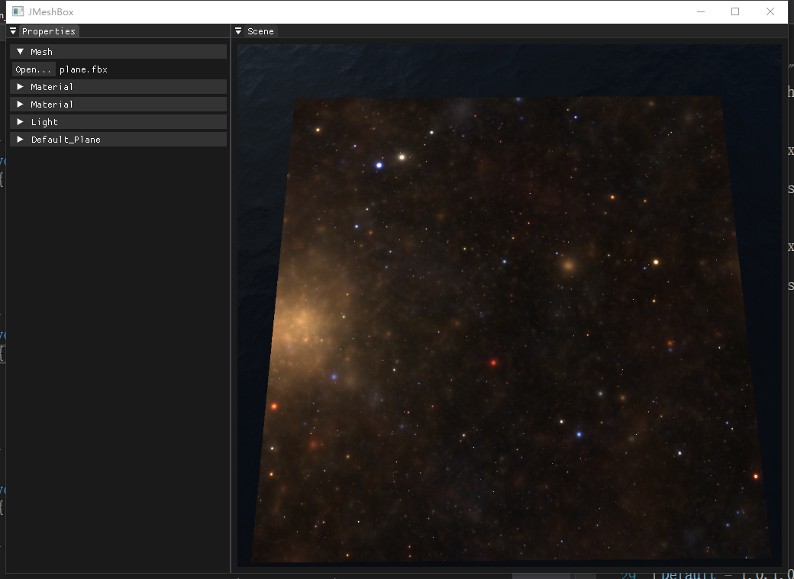

# 星空材质（Night Sky）

## 实现内容

星空效果使用独立材质配置与片元着色器：

- 配置：`Assets/NightSky.xml`
- Shader：`shaders/nightsky_vs.shader` + `shaders/nightsky_fs.shader`

`nightsky_fs.shader` 采用分形迭代的体积感写法，按时间参数推进采样，形成动态星云/星空流动效果。

## 参数来源

- `time`：在渲染阶段每帧传入（`glfwGetTime()`）。
- `camPos`：由相机更新时传入，用于与世界坐标组合出观察方向。

## 使用方式

1. 通过 Property 面板加载任意模型。
2. 选择 `NightSky.xml` 材质。
3. 观察时间驱动下的动态星空表现。

> 说明：`NightSky.xml` 当前未暴露额外可调参数，后续可加入星空亮度、色调和迭代步数控制。

