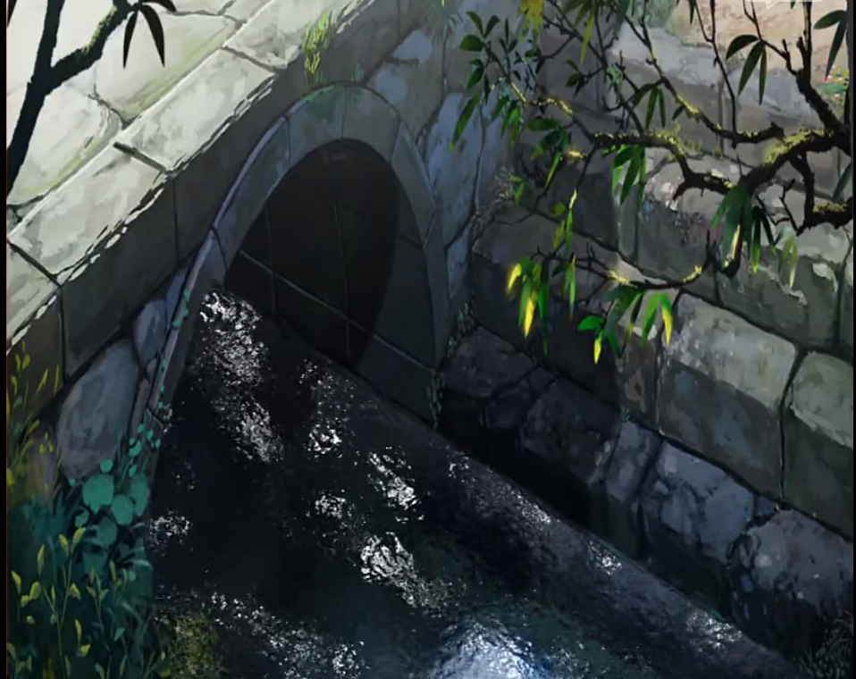

# 天气效果（按当前实现）

## 当前已实现

当前仓库里与天气相关的实现分成两部分：

1. **材质级水面效果**：`JGL_Engine/shaders/river_fs.shader`
2. **屏幕空间雨/雪后处理效果**：
   - `Assets/screen_effects/Rain.xml` + `JGL_Engine/shaders/screen_effect_rain_fs.shader`
   - `Assets/screen_effects/Snow.xml` + `JGL_Engine/shaders/screen_effect_snow_fs.shader`
   - 全屏顶点着色器：`JGL_Engine/shaders/post_process_vs.shader`

## 材质级水面（river_fs）

`river_fs.shader` 通过 `baseMap` + `waterbumpMap` 做 UV 扰动与简单高光：

- `baseMap.a` 用于区分河流区域
- `_RiverParam01`：
  - `x`：UV 缩放
  - `y`：流动速度
  - `z`：法线采样缩放
- 输出为底图叠加高光近似（非物理精确水体）

## 屏幕空间雨/雪后处理

### 接入位置

- 渲染主流程在 `RenderEngine::render()` 结束时调用 `PostProcessStack::render(...)`
- 输入纹理来自主离屏帧缓冲颜色附件（uniform 名为 `hdrBuffer`，但当前主帧缓冲是 LDR）
- `Property_Panel` 的 `Screen Effects` 面板会扫描 `Assets/screen_effects/` 下的 `.xml/.mtl` 并可实时切换

### Rain（`ScreenRain`）

配置：`Assets/screen_effects/Rain.xml`

着色器参数（当前已实现）：

- `noiseMap`（Texture）
- `tint`（float3）
- `density`（float）
- `speed`（float）
- `tilt`（float）
- `brightness`（float）
- `trailLength`（float）
- `distortion`（float）

效果特点：基于噪声与栅格随机生成斜向雨丝，两层叠加后与场景颜色混合。

### Snow（`ScreenSnow`）

配置：`Assets/screen_effects/Snow.xml`

着色器参数（当前已实现）：

- `flakeColor`（float3）
- `density`（float）
- `speed`（float）
- `size`（float）
- `drift`（float）
- `softness`（float）
- `brightness`（float）

效果特点：基于 hash 的多层雪花采样，按密度/大小/摆动参数叠加到场景颜色。

## 当前未实现 / 已降级说明

以下内容在当前代码中未接入，本页不再按“已实现”描述：

- 基于 `SceneDepth` 的深度衰减天气混合
- 镜头雨滴拖痕、屏幕边缘积水、体积降水
- 独立的 `weather_screen_vs/fs.shader` 统一天气框架
- `Assets/WeatherRain.xml` / `Assets/WeatherSnow.xml` 这套命名资源

