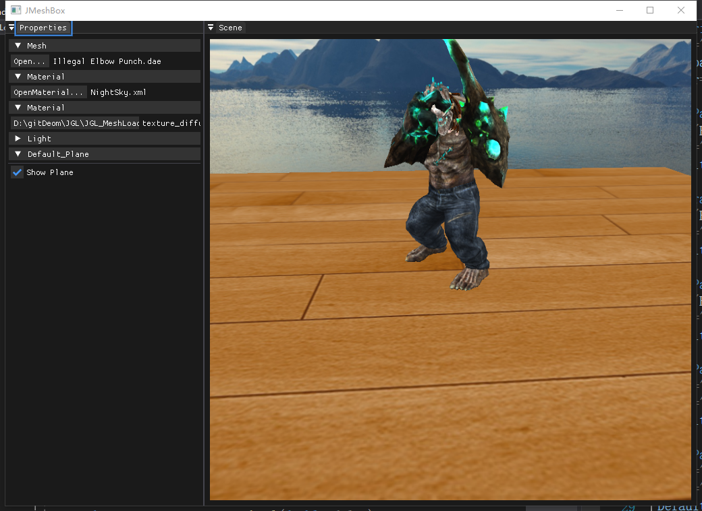

# 骨骼动画加载

## 流程概览

骨骼动画在模型加载阶段自动识别并启用：

1. 通过 `MeshComponent::set_model()` 加载 `Model`。
2. `Model` 在 Assimp 解析时提取骨骼权重（`ExtractBoneWeightForVertices`）。
3. 若模型包含骨骼，切换到 `Anim.xml` 材质并创建 `Animation/Animator`。
4. 每帧 `Animator::UpdateAnimation(dt)` 计算骨骼矩阵。
5. 将 `finalBonesMatrices[i]` 传入 Shader，完成 GPU 蒙皮。

## 关键类

- `Model`：提取网格、骨骼映射、骨骼偏移矩阵。
- `Animation`：读取动画通道、层级节点、骨骼 ID 对应关系。
- `Animator`：递归计算当前时刻骨骼全局变换并输出最终矩阵。
- `Bone`：对位置/旋转/缩放关键帧做插值（`mix` + `slerp`）。

## 使用方式

1. 在 Inspector 中先加载带骨骼的 `fbx/dae/gltf` 模型，或直接加载 `.janim` 动画资源。
2. `.janim` 会描述骨架模型、动画源文件以及默认播放参数，例如 `Assets/animations/vampire_dance.janim`。
3. 程序会切换到动画材质 `Assets/materials/Anim.xml`，并创建 `Animation/Animator`。
4. 若要控制播放，可在 `Animation Playback` 面板中切换 Play / Pause / Stop、Loop 和 Speed。
5. 若要替换动画贴图，可修改 `Assets/materials/Anim.xml` 中 `tex` 参数。

