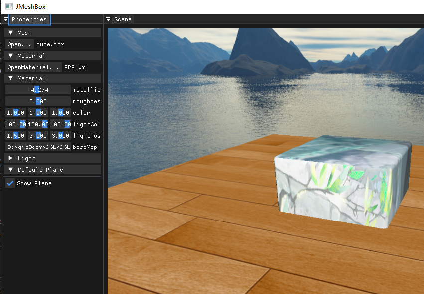
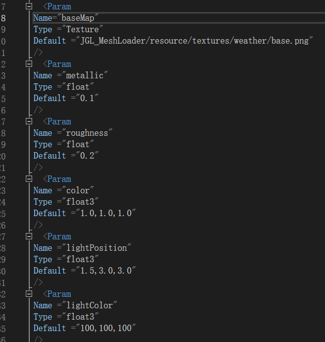

# 编辑器架构

## 概览

当前编辑器由 `Application -> GLWindow -> SceneView/PropertyPanel` 组成，核心职责如下：

- `main.cpp` 负责创建 `Application` 并进入主循环。
- `GLWindow` 负责窗口生命周期、渲染调用顺序与输入转发。
- `SceneView` 负责场景渲染（模型、材质、天空盒、地面、骨骼动画）。
- `PropertyPanel` 负责 ImGui 参数面板与文件选择（模型/材质）。

## 渲染与 UI 流程

每帧调用顺序在 `GLWindow::render()` 中：

1. `OpenGL_Context::pre_render()` 清屏。
2. `UIContext::pre_render()` 创建 DockSpace。
3. `SceneView::render()` 渲染到 FBO 并展示到 `Scene` 窗口。
4. `PropertyPanel::render()` 绘制属性面板并处理文件加载。
5. `UIContext::post_render()` 提交 ImGui。
6. `OpenGL_Context::post_render()` 交换缓冲并轮询事件。

## 材质加载

材质由 `Material::load()` 从 XML 读取并建立参数映射：

- `Type=Texture` -> 加载纹理并缓存到 `mTexture_map`。
- `Type=float` -> 写入 `mFloat_map`。
- `Type=float3` -> 写入 `mFloat3_map`。

运行时由 `Material::update_shader_params()` 统一把参数推送到 Shader，实现“配置即渲染”。

## 模型加载

模型在 `PropertyPanel` 里通过 `Open...` 选择，支持 `fbx/obj/dae`。  
`SceneView::load_mesh()` 使用 `Model`（Assimp）加载网格；若检测到骨骼数据，会自动切换到动画材质流程并初始化 `Animation/Animator`。

## 交互控制

- 鼠标拖拽：旋转视角（`SceneView::on_mouse_move`）。
- 滚轮 / `W/S`：缩放视距（`on_mouse_wheel`）。
- `F`：重置相机视角（`reset_view`）。

