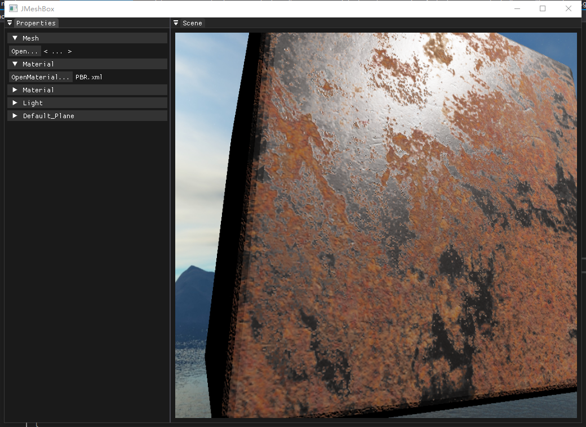

# PBR 材质

## 实现概览

项目默认材质为 PBR：

- 配置：`Assets/PBR.xml`
- Shader：`shaders/pbr_vs.shader` + `shaders/pbr_fs.shader`
- 默认贴图：
  - `albedo.png`
  - `metallic.png`
  - `roughness.png`
  - `normal.png`

## 渲染模型

`pbr_fs.shader` 使用 Cook-Torrance BRDF，包含：

- `DistributionGGX` 法线分布项
- `GeometrySmith` 几何遮蔽项
- `fresnelSchlick` 菲涅耳项
- 法线贴图 TBN 重建与 gamma/tonemap 处理

## 编辑器联动

在 Property 面板可实时调节 XML 中的参数（`float/float3/Texture`），参数会通过 `Material::update_shader_params()` 推送到当前 Shader，实现所见即所得。

## 使用建议

- 对金属材质优先保证 `metallic/roughness` 贴图质量。
- 若场景偏暗，可先调高 `lightColor`，再细调粗糙度。

