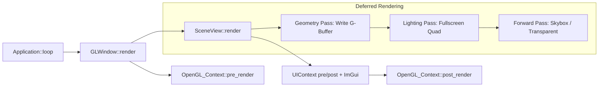

# 延迟渲染管线设计与集成方案

## 1. 总体设计目标

### 1.1 目标

在现有基于 OpenGL 的前向渲染框架上新增一套可切换的延迟渲染管线，实现：

- 几何 Pass：输出 G-Buffer
- 光照 Pass：在屏幕空间完成灯光合成
- 与现有 PBR 材质、模型、灯光和 ImGui 界面协同工作
- 在 UI 中支持 `Forward / Deferred` 渲染模式切换

### 1.2 范围

- 修改或扩展渲染基础设施：`RenderContext / FrameBuffer / OpenGL_FrameBuffer`
- 在 `SceneView` 中增加延迟渲染专用 G-Buffer FBO 与渲染流程
- 新增延迟渲染着色器
- 重用当前材质系统中的 PBR 数据布局

### 1.3 非目标

第一版不包含：

- Clustered / Tiled Shading
- 完整透明延迟方案
- SSAO、SSR、Bloom 等后处理链打通
- 阴影贴图系统

## 2. 现有结构梳理

结合当前代码，现有渲染链路如下：

- `Application::loop()` 驱动主循环
- `GLWindow::render()` 负责每帧渲染与 UI
- `OpenGL_Context::pre_render()` 清理默认帧缓冲
- `SceneView::render()` 负责离屏渲染到 `mFrameBuffer`
- ImGui `Scene` 面板最终显示 `mFrameBuffer->get_texture()`

当前涉及的核心文件：

- `JGL_MeshLoader/source/application.cpp`
- `JGL_MeshLoader/source/window/jgl_window.cpp`
- `JGL_MeshLoader/source/render/render_base.h`
- `JGL_MeshLoader/source/render/opengl_context.cpp`
- `JGL_MeshLoader/source/render/opengl_buffer_manager.h`
- `JGL_MeshLoader/source/render/opengl_buffer_manager.cpp`
- `JGL_MeshLoader/source/ui/scene_view.h`
- `JGL_MeshLoader/source/ui/scene_view.cpp`

### 2.1 当前瓶颈

当前 `SceneView` 只支持：

- 单个离屏颜色附件
- 一个主模型 + 一个主材质的前向绘制
- 灯光参数直接通过当前 shader 更新

这对前向渲染可用，但不足以支撑：

- 多光源屏幕空间光照
- G-Buffer 多附件输出
- Forward / Deferred 管线切换

## 3. 设计原则

- 保留现有前向渲染作为基线路径
- 延迟渲染优先做成“新增路径”，而不是直接替换现有流程
- `SceneView` 仍然对 ImGui 输出单张最终颜色纹理
- G-Buffer 只服务于延迟管线，不干扰前向管线
- 材质通道继续沿用当前 `Material + XML` 模型

## 4. 延迟渲染总体架构

建议在 `SceneView` 内部形成两级 FBO：

- `mGBuffer`
  - 延迟几何 Pass 输出
  - 包含位置 / 法线 / 反照率+金属度 / 深度
- `mFrameBuffer`
  - 现有显示 FBO
  - 光照 Pass 和后续 forward 追加 Pass 都写入这里

渲染模式由 `SceneView` 维护：

```cpp
enum class RenderMode
{
    Forward = 0,
    Deferred = 1
};
```

## 5. G-Buffer 设计

第一版建议采用世界空间存储，原因是当前 PBR shader 已经使用：

- `WorldPos`
- `Normal`
- `camPos`
- `lightPosition`

这样可以最大程度复用已有光照逻辑，减少世界空间 / 观察空间转换的重构成本。

### 5.1 附件布局

| Attachment | 格式 | 内容 |
| --- | --- | --- |
| `GL_COLOR_ATTACHMENT0` | `GL_RGBA16F` | `worldPos.xyz + reserved` |
| `GL_COLOR_ATTACHMENT1` | `GL_RGBA16F` | `normal.xyz + roughness` |
| `GL_COLOR_ATTACHMENT2` | `GL_RGBA8` | `albedo.rgb + metallic` |
| Depth | `GL_DEPTH24_STENCIL8` 或 `GL_DEPTH_COMPONENT24` | 深度 |

### 5.2 初版材质通道

结合当前 `Material` 和 `PBR.xml`，统一约定：

- `baseMap`：反照率
- `metallicMap`：金属度
- `roughnessMap`：粗糙度
- `normalMap`：法线贴图
- `color`：反照率乘色

初版先不把以下通道写入 G-Buffer：

- AO
- Emissive
- Clear Coat

后续如果需要，可以增加：

- `AO` 写入法线附件 alpha 或增加单独附件
- `Emissive` 走独立附件或在光照后追加

## 6. 渲染基础设施改造

### 6.1 扩展 `FrameBuffer` 抽象

当前 `FrameBuffer` 只有：

```cpp
virtual void create_buffers(int32_t width, int32_t height) = 0;
virtual uint32_t get_texture() = 0;
```

建议扩展为兼容单附件与多附件：

```cpp
virtual void create_buffers(int32_t width, int32_t height) = 0;
virtual uint32_t get_texture(size_t index = 0) = 0;
virtual uint32_t get_depth_texture() = 0;
virtual size_t get_color_attachment_count() const = 0;
```

对应 `FrameBuffer` 基类内部成员调整为：

```cpp
std::vector<uint32_t> mColorAttachments;
uint32_t mDepthId = 0;
```

### 6.2 `OpenGL_FrameBuffer` 兼容设计

建议保留现有单色模式，同时支持多附件模式。

可选实现方式有两种：

#### 方案 A：直接扩展 `OpenGL_FrameBuffer`

优点：

- 基础设施统一
- 后续 Post Process 也能复用

缺点：

- 抽象稍重

#### 方案 B：新增 `DeferredGBuffer`

优点：

- 逻辑更聚焦
- 对现有 `OpenGL_FrameBuffer` 改动小

缺点：

- FBO 管理会分成两套

### 6.3 推荐方案

推荐采用混合方案：

- `OpenGL_FrameBuffer` 继续承担“显示 FBO / 普通离屏 FBO”
- 新增 `DeferredGBuffer` 负责 G-Buffer 专用逻辑

原因：

- 现有 `mFrameBuffer` 的用途已经很明确
- G-Buffer 附件布局固定，单独封装更清晰
- 可以减少对现有 UI 显示链的冲击

## 7. `DeferredGBuffer` 设计

建议新增文件：

- `JGL_MeshLoader/source/render/deferred_gbuffer.h`
- `JGL_MeshLoader/source/render/deferred_gbuffer.cpp`

建议接口：

```cpp
class DeferredGBuffer
{
public:
    bool init(int32_t width, int32_t height);
    void resize(int32_t width, int32_t height);
    void destroy();

    void bind_for_geometry_pass();
    void unbind();

    uint32_t position_texture() const;
    uint32_t normal_roughness_texture() const;
    uint32_t albedo_metallic_texture() const;
    uint32_t depth_texture() const;
};
```

### 7.1 内部资源

- `mFBO`
- `mPositionTex`
- `mNormalRoughnessTex`
- `mAlbedoMetallicTex`
- `mDepthTex`

### 7.2 初始化流程

- `glGenFramebuffers`
- 创建 3 张颜色纹理并分别绑定到 `GL_COLOR_ATTACHMENT0/1/2`
- 创建深度纹理或深度模板纹理
- `glDrawBuffers(3, attachments)`
- `glCheckFramebufferStatus(GL_FRAMEBUFFER)`

## 8. SceneView 集成方案

### 8.1 新增成员

`SceneView` 建议新增：

```cpp
RenderMode mRenderMode = RenderMode::Forward;
std::unique_ptr<nrender::DeferredGBuffer> mGBuffer;
std::unique_ptr<nshaders::Shader> mDeferredGeometryShader;
std::unique_ptr<nshaders::Shader> mDeferredLightingShader;
uint32_t mQuadVAO = 0;
uint32_t mQuadVBO = 0;
```

### 8.2 新增方法

```cpp
void init_deferred_pipeline();
void render_forward();
void render_deferred();
void geometry_pass();
void lighting_pass();
void forward_overlay_pass();
void render_fullscreen_quad();

void set_render_mode(RenderMode mode);
RenderMode get_render_mode() const;
```

### 8.3 `render()` 分支逻辑

建议将现有 `SceneView::render()` 改造成总控函数：

```cpp
void SceneView::render()
{
    if (mRenderMode == RenderMode::Forward)
        render_forward();
    else
        render_deferred();

    draw_scene_panel();
}
```

## 9. 延迟渲染流程

### 9.1 Geometry Pass

目标：

- 将所有不透明物体写入 G-Buffer

流程：

1. `mGBuffer->bind_for_geometry_pass()`
2. 清理颜色和深度
3. 使用 `deferred_gbuffer_vs/fs.shader`
4. 绘制所有不透明模型
5. 不在此阶段绘制天空盒

写入内容：

- `gPosition = worldPos`
- `gNormalRoughness.rgb = normal`
- `gNormalRoughness.a = roughness`
- `gAlbedoMetallic.rgb = albedo`
- `gAlbedoMetallic.a = metallic`

### 9.2 Lighting Pass

目标：

- 使用全屏四边形对 G-Buffer 做逐像素光照合成

流程：

1. 解绑 G-Buffer
2. 绑定 `mFrameBuffer`
3. 清理 `mFrameBuffer`
4. 绑定 G-Buffer 三张颜色纹理
5. 使用 `deferred_lighting_vs/fs.shader`
6. 传入灯光、相机参数
7. 绘制全屏 Quad

结果：

- 最终光照结果写入现有 `mFrameBuffer` 的颜色纹理
- ImGui 仍然只采样 `mFrameBuffer->get_texture()`

### 9.3 Forward Overlay Pass

目标：

- 处理不适合走延迟路径的内容

建议顺序：

1. 天空盒
2. 透明物体
3. 调试辅助几何

## 10. 天空盒、透明和平面策略

### 10.1 天空盒

推荐方案：

- 不写入 G-Buffer
- 在光照 Pass 之后，以 forward 方式绘制到 `mFrameBuffer`

原因：

- 天空盒不需要参与延迟光照
- 可继续复用当前天空盒 shader

### 10.2 透明物体

第一版建议：

- 统一在光照 Pass 之后按 forward 绘制
- 开启深度测试与 alpha blending

原因：

- 延迟渲染对透明支持天然较弱
- 当前项目尚未建立透明对象分类，先保留简单路线更稳

### 10.3 地面平面

平面可视为普通不透明对象，建议直接进入 Geometry Pass。

这样做的好处：

- 统一参与延迟光照
- 不需要维护特殊分支

## 11. Shader 设计

### 11.1 新增着色器

建议新增文件：

- `JGL_MeshLoader/shaders/deferred_gbuffer_vs.shader`
- `JGL_MeshLoader/shaders/deferred_gbuffer_fs.shader`
- `JGL_MeshLoader/shaders/deferred_lighting_vs.shader`
- `JGL_MeshLoader/shaders/deferred_lighting_fs.shader`

### 11.2 G-Buffer Shader

职责：

- 采样材质贴图
- 计算世界空间位置、法线
- 将几何属性写入多个 MRT 附件

### 11.3 Lighting Shader

职责：

- 采样 G-Buffer
- 遍历灯光
- 执行简化或复用现有 PBR BRDF
- 输出最终颜色

### 11.4 光照模型复用建议

当前 `pbr_fs.shader` 已具备单灯 PBR 逻辑。  
建议在延迟光照 shader 中优先复用以下计算块：

- Fresnel
- GGX Distribution
- GeometrySmith
- Cook-Torrance BRDF

只需将输入改成来自 G-Buffer 的：

- `albedo`
- `metallic`
- `roughness`
- `normal`
- `worldPos`

## 12. 材质系统扩展

当前 `Material` 已支持：

- Texture 参数
- float 参数
- float3 参数

为了让前向与延迟共用同一套材质描述，建议在设计层面明确 PBR 约定：

- `baseMap`
- `metallicMap`
- `roughnessMap`
- `normalMap`
- `color`

对 `PBR.xml` 的要求：

- 必须能提供延迟几何 Pass 所需通道
- 不在光照 Pass 里直接访问 `Material` 对象

设计原则：

- 几何 Pass 读取材质
- 光照 Pass 只读 G-Buffer

这样可以降低光照阶段与材质系统的耦合。

## 13. UI 与交互集成

### 13.1 Property Panel 增加渲染模式切换

建议在 `Property_Panel::render()` 中增加：

- `Forward`
- `Deferred`

例如：

```cpp
static int renderMode = 0;
ImGui::Combo("Render Mode", &renderMode, "Forward\0Deferred\0");
scene_view->set_render_mode(renderMode == 0 ? RenderMode::Forward : RenderMode::Deferred);
```

### 13.2 可选调试功能

为了方便调试 G-Buffer，建议后续增加：

- GBuffer Debug View
  - Final
  - Position
  - Normal
  - Albedo
  - Roughness
  - Metallic

这可以显著降低 shader 联调成本。

## 14. 尺寸变化与资源重建

当前 `SceneView::resize()` 只会调整 `mFrameBuffer`。  
接入延迟管线后，需要同步：

- `mFrameBuffer->create_buffers(width, height)`
- `mGBuffer->resize(width, height)`

注意：

- 所有颜色附件和深度附件都必须跟随 `Scene` 面板尺寸重建
- 若后续引入后处理链，也应统一在这里处理 resize

## 15. 性能与可扩展性考虑

### 15.1 性能

延迟渲染的收益主要来自：

- 光照计算与几何复杂度解耦
- 多光源成本更稳定

代价：

- 显存占用上升
- 带宽压力增加

第一版建议：

- Position / Normal 使用 `16F`
- Albedo / Metallic 使用 `RGBA8`
- 先支持有限数量灯光，例如 16 个

### 15.2 可扩展性

通过 `DeferredGBuffer` 独立封装，后续可平滑扩展：

- AO
- Emissive
- SSR
- SSAO
- Bloom 输入

## 16. 分阶段集成计划

### 阶段一：基础设施

- 新增 `DeferredGBuffer`
- 初始化多附件 FBO
- 新增全屏 Quad
- 新增 `RenderMode`

### 阶段二：Geometry Pass

- 编写 G-Buffer shader
- 让模型与平面写入 G-Buffer
- 验证 Position / Normal / Albedo 输出正确

### 阶段三：Lighting Pass

- 编写光照 shader
- 使用 G-Buffer 合成最终颜色到 `mFrameBuffer`
- 打通点光或单主灯

### 阶段四：前向叠加

- 天空盒 forward 叠加
- 透明物体 forward 叠加
- UI 切换渲染模式

### 阶段五：调试与优化

- G-Buffer 可视化
- 灯光数组优化
- 减少不必要的格式开销

## 17. 推荐代码改动点清单

建议优先改这些文件：

- `JGL_MeshLoader/source/render/render_base.h`
- `JGL_MeshLoader/source/render/opengl_buffer_manager.h`
- `JGL_MeshLoader/source/render/opengl_buffer_manager.cpp`
- `JGL_MeshLoader/source/render/deferred_gbuffer.h`
- `JGL_MeshLoader/source/render/deferred_gbuffer.cpp`
- `JGL_MeshLoader/source/ui/scene_view.h`
- `JGL_MeshLoader/source/ui/scene_view.cpp`
- `JGL_MeshLoader/source/ui/property_panel.cpp`
- `JGL_MeshLoader/source/ui/property_panel.h`
- `JGL_MeshLoader/shaders/deferred_gbuffer_vs.shader`
- `JGL_MeshLoader/shaders/deferred_gbuffer_fs.shader`
- `JGL_MeshLoader/shaders/deferred_lighting_vs.shader`
- `JGL_MeshLoader/shaders/deferred_lighting_fs.shader`

## 18. 流程示意



## 19. 结论

对于当前项目，最平滑的延迟渲染接入方案是：

1. 保留现有 `mFrameBuffer` 作为 Scene 面板最终显示目标
2. 新增 `DeferredGBuffer` 作为几何 Pass 输出目标
3. 在 `SceneView` 中加入 `Forward / Deferred` 两套渲染分支
4. 将天空盒和透明对象继续保留在 forward 追加阶段

这样做的优点是：

- 对现有 UI 展示链路改动最小
- 对当前材质与 PBR 逻辑复用度最高
- 后续增加更多光源或后处理时有清晰扩展路径
