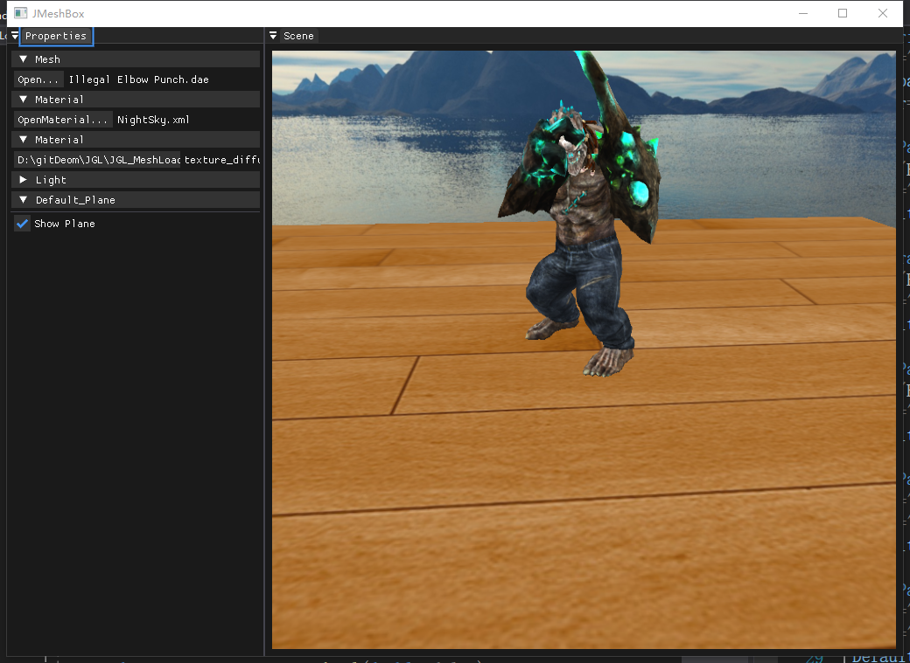

# 骨骼动画加载

## 流程概览

骨骼动画在模型加载阶段自动识别并启用：

1. `SceneView::load_mesh()` 创建 `Model`。
2. `Model` 在 Assimp 解析时提取骨骼权重（`ExtractBoneWeightForVertices`）。
3. 若模型包含骨骼，切换到 `Anim.xml` 材质并创建 `Animation/Animator`。
4. 每帧 `Animator::UpdateAnimation(dt)` 计算骨骼矩阵。
5. 将 `finalBonesMatrices[i]` 传入 Shader，完成 GPU 蒙皮。

## 关键类

- `Model`：提取网格、骨骼映射、骨骼偏移矩阵。
- `Animation`：读取动画通道、层级节点、骨骼 ID 对应关系。
- `Animator`：递归计算当前时刻骨骼全局变换并输出最终矩阵。
- `Bone`：对位置/旋转/缩放关键帧做插值（`mix` + `slerp`）。

## 使用方式

1. 在 Property 面板选择带骨骼动画的 `fbx/dae` 模型。
2. 程序会自动切换动画 Shader（`animmodel_fs.shader`）与动画更新流程。
3. 若要替换动画贴图，可修改 `Assets/Anim.xml` 中 `tex` 参数。

